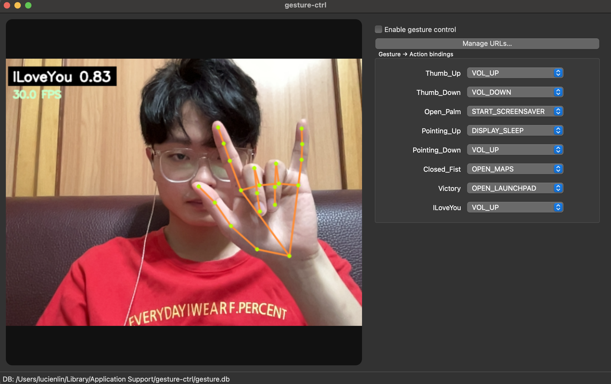
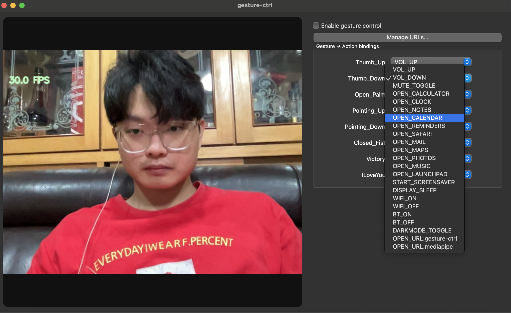
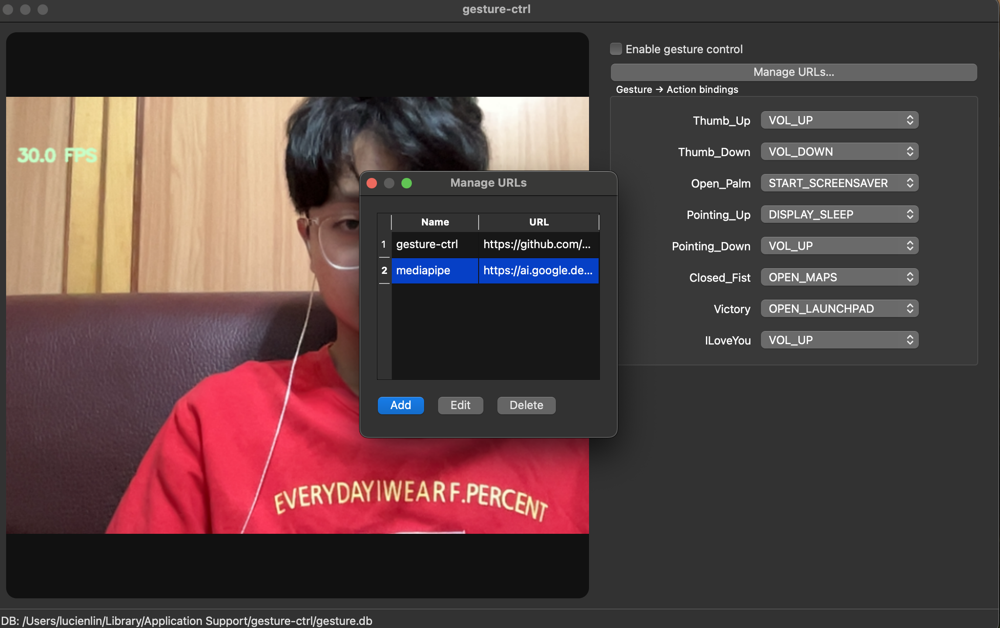

# Gesture Ctrl

AI-powered hand gesture control app for macOS.  
Use your camera to recognize gestures and instantly trigger system actions like volume control, app launching, or opening custom URLs — no keyboard or mouse required.  

---

## 🚀 Quick Start

### Option 1: Download the App
👉 [Download Gesture Ctrl for macOS](https://github.com/Lucien1999s/gesture-ctrl/releases/tag/v0.1.0)  

After downloading:
1. Unzip and move `gesture-ctrl.app` to Applications.  
2. On first launch, macOS will warn:  
   *“Apple could not verify gesture-ctrl …”*  
   - Go to **System Settings → Privacy & Security → Open Anyway**,  
   - Or right-click → **Open**.  
3. Grant **Camera access** when prompted.  

### Option 2: Run Locally from Source

```bash
git clone git@github.com:Lucien1999s/gesture-ctrl.git
```

```bash
cd gesture-ctrl
```

```bash
pip install -r requirements.txt
```

```bash
python3 app_gui.py
```

---

## ✨ Features Showcase

### 1. Enable Gesture Control

When you open the app, **gesture control is disabled by default**.
Click the **“Enable gesture control”** toggle to let gestures control your system.
⚠️ Make sure to allow **Camera access** in macOS permissions.



---

### 2. Map Gestures to Actions

Each gesture (👍 👎 ✊ ✌️ ✋ etc.) can be mapped to different system actions:

* Volume up/down, mute
* Launch Calculator, Safari, Music, etc.
* System functions like Dark Mode toggle, Screensaver, Wi-Fi on/off
* **Open URL** action



---

### 3. Manage Custom URLs

You can **add, edit, or delete multiple URL presets** (up to 10).
Each preset has a custom name, and you can select which one the `OPEN_URL` gesture will open.



---

## 📜 License

MIT License © 2025 Lucien Lin
